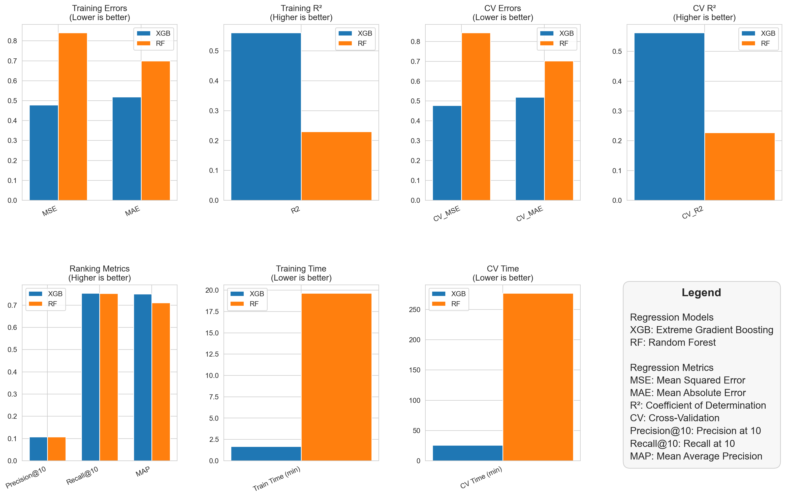

# MediaRec

A movie recommender system created as part of an Artificial Intelligence university project.

## Features

- Movie recommendation engine  
- User profiles  
- Search functionality  
- Data processing and integration with TMDB  
- Web interface (HTML/CSS/JS)  

## Folder Structure

- `core` : Database setup, logging, utilities  
- `data` : Data processing and loading  
- `models` : Data models (media, user)  
- `recommender` : Recommendation engine and training  
- `static` : Frontend assets (CSS, JS)  
- `templates` : HTML templates  

## Installation

1. Clone the repository:
   
   ```bash
   git clone https://github.com/OliverKozul/MediaRec.git
   ```
2. Install the required dependencies:

    ```bash
    pip install -r requirements.txt
    ```
3. Run the app:

   ```bash
   python app.py
   ```

## Requirements

To run this project locally, you need the following:

- Python 3.10+ (Tested with Python 3.10.6)
- See requirements.txt for dependencies

# Implementation Details

The following sections describe the steps I took when implementing this project.

## Data

To train the model used to predict user preferences, the [MovieLens 32M Dataset](https://grouplens.org/datasets/movielens/) was used.
The number of samples is excessive for the scope of this project and the capabilities of my computer but the data was up-to-date and proved extremely useful.
MovieLens does offer a dataset containing 1 million user ratings which would have been sufficient but it was not used due to the data being over 20 years old.

MovieLens provided three tables: 
  - movies.csv listing movies, with their respective IDs, titles and genres.
  - links.csv linking the movie IDs with their IMDB and TMDB IDs.
  - ratings.csv containing 32 million user ratings which were used for model training.

The limiting factor during training was my computer's RAM capacity as the sheer volume of textual information proved overwhelming.
To be able to store all the data in memory, I had to randomly select a smaller portion of the whole dataset for training.
Approximately 30000 different movies with 25 user ratings each was the maximum my 32 gigabytes of RAM could handle.
The chosen subset comprised the following number of unique samples:
  - 5000 directors
  - 25000 actors
  - 20 genres

This data slice, while comparatively small, was sufficient in training a competent recommendation model.

### Enrichment

To provide the model with a broader context of user preferences beyond movie genres, I utilized TMDB's generous developer API to fetch movie descriptions, actors and directors.
Additionally, movie posters were saved to visually improve the user experience in the final web application.

### Preprocessing

Having gathered all the necessary data, I proceeded with dataset cleaning and preprocessing.
Each movie entry in the dataset listed many genres and actors, yet limiting both categories to the top three values proved to be sufficient while reducing noise.
Even after removing stop words, including movie descriptions undermined performance during training and testing due to which they were removed from the set of input features.

## Training

Upon completion of data preprocessing, the movie and the rating dataset were merged by the movie IDs, thus obtaining the final dataset used in model training.
Before settling for a XGBoost regression model, I initially experimented with Random Forest regressors and a deep learning approach.

As the neural network was too computationally intense and did not provide substantial benefit, it was not a viable solution.
Random Forest produced slightly worse results while increasing training times compared to XGBoost.
Since the validity of movie recommendations is highly subjective, performance metrics for XGBoost and Random Forest were computed to mathematically determine a winner.
As seen in the figure below, XGBoost prevailed in every category, therefore cementing itself as the obvious choice for this project.



The goal of the model was to minimize errors when predicting user ratings given the previously mentioned features.
Modifying hyperparameters did not alter the results significantly, except for n_jobs, which decreased training time drastically by parallelizing the process.
The main bottleneck during this phase was RAM, as the datasets utilized were extremely large.

## Web UI

To provide a pleasant user experience, a simple web application was created.
This part of the project was not my main focus; therefore, I did not implement many features as it primarily served as a medium to display results.
I allowed the user to register and login on the website as well as rate various movies, thereby giving the model insight into their preferences.
Additionally, on the home page, users can adjust a temperature slider, a scaling factor to bias ranking diversity that affects the ranking score of the content.
Decreasing the temperature gives higher precedence to movies similar to the user's preferences.
In contrast, increasing the temperature leads to a more diverse selection of movies that should still be appealing to the user.

## Project Structure

- As this project was written in Python, I used Flask for my web framework.
- The user and movie data is stored in a local SQLite database.
- I defined a user and media class that serve as an interface with the database.

All the previously mentioned systems work together to offer users a useful tool when looking for new viewing content.
